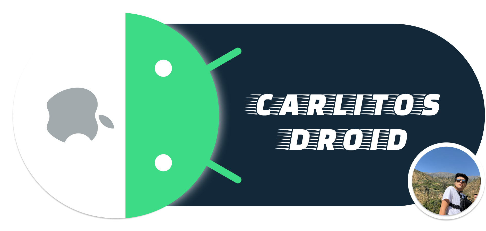

    <picture>
      <source media="(prefers-color-scheme: dark)" srcset="res/carlitosdroid_logo.png">
      
    </picture>

  

  
  
  
  
  
  
  
  
  
  
  
  
  
  
  
  
  
  
  
  
  
  
  
  

<a href="https://carlitosdroid-gzzc6o6a6q-uc.a.run.app">
  <picture>
    <source media="(prefers-color-scheme: dark)" srcset="res/portafolio_logo.png">
    
  </picture>
</a>